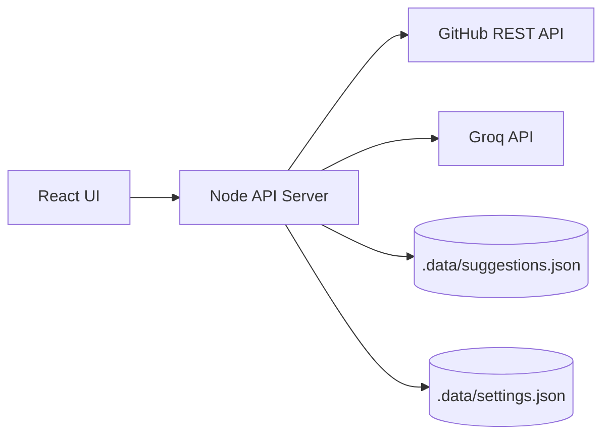

# PR Recommender

GitHub Pull Requestから技術記事のテーマと下書きを生成し、提案として管理するAIアプリケーションです。

開発中に得られた技術的な知見は、Pull Requestの説明、差分、レビュー、ラベルなどに蓄積されます。PR Recommenderは、それらのPR情報をもとに「記事にできそうなテーマ」を見つけ、記事化の理由や下書きまで生成することを目的としています。

## 主な機能

- GitHub RepositoryからPull Requestを取得
- PR情報の正規化
- PRをもとにした記事テーマ生成
- 記事下書きMarkdownの生成
- 生成した提案データの保存
- 提案ステータスの更新
- GitHub連携や通知設定の保存
- ダッシュボード、提案一覧、PR分析、設定画面のUI

## 現在の実装範囲

### 実装済み

- `owner/repo` を指定したGitHub PR取得
- GitHub APIレスポンスをアプリ用のPRデータへ正規化
- Groq APIを使った記事テーマ生成
- 記事下書きMarkdownの生成
- 生成した提案のローカルJSON保存
- 保存済み提案の読み込み
- 提案ステータスの更新
- 設定画面の入力内容保存
- UIレイアウト、サイドバー、ヘッダー、カード、フォーム、詳細表示

### 未実装

- 認証/ユーザー管理
- DB保存
- 複数ユーザー対応
- 複数リポジトリ横断分析
- 過去記事との重複チェック
- RAG
- 記事編集画面
- 記事公開ワークフロー

## 技術スタック

- Frontend: React 18 / TypeScript / Vite
- Styling: Tailwind CSS
- Icons: lucide-react
- Backend: Node.js built-in HTTP server
- External API: GitHub REST API
- AI: Groq Chat Completions API
- Storage: Local JSON files
- Package manager: npm

## アーキテクチャ



ブラウザからGitHub APIやAI APIを直接呼ばず、同梱のNodeサーバーを経由します。`GITHUB_TOKEN` や `GROQ_API_KEY` はサーバー側の環境変数として扱い、クライアント側へ露出させない構成にしています。

MVP段階ではDBを使わず、提案データと設定データをローカルJSONに保存します。保存処理はサーバー側APIに閉じているため、後からDBへ置き換えやすい構成です。

## API

| Endpoint | Method | Description |
| --- | --- | --- |
| `/api/github/prs` | GET | GitHub PR一覧を取得 |
| `/api/suggestions/generate` | POST | PRから記事テーマと下書きを生成 |
| `/api/suggestions` | GET | 保存済み提案を取得 |
| `/api/suggestions` | POST | 提案を保存 |
| `/api/suggestions/:id/status` | PATCH | 提案ステータスを更新 |
| `/api/settings` | GET | 設定を取得 |
| `/api/settings` | PUT | 設定を保存 |

## データ保存

デフォルトでは、MVP向けに以下のローカルJSONへ保存します。

```text
.data/suggestions.json
.data/settings.json
```

保存先は環境変数で変更できます。

```bash
SUGGESTIONS_STORE_PATH=
SETTINGS_STORE_PATH=
```

`.data/` 配下はローカル実行時のデータ保存先であり、Git管理対象には含めません。

## セットアップ

```bash
npm install
cp .env.example .env
npm run dev
```

起動後、ブラウザで以下を開きます。

```text
http://127.0.0.1:5173/
```

## 環境変数

```bash
GITHUB_TOKEN=
GROQ_API_KEY=
GROQ_MODEL=llama-3.3-70b-versatile
SUGGESTIONS_STORE_PATH=
SETTINGS_STORE_PATH=
```

### `GITHUB_TOKEN`

GitHub API用のトークンです。Public Repositoryは未設定でも取得できますが、Private Repositoryの取得やrate limit緩和が必要な場合は設定します。

### `GROQ_API_KEY`

記事テーマと下書き生成に使用します。

### `GROQ_MODEL`

Groqで使用するモデル名です。未設定時はサーバー側のデフォルトを使用します。

### `SUGGESTIONS_STORE_PATH`

提案データの保存先を変更したい場合に設定します。未設定時は `.data/suggestions.json` を使用します。

### `SETTINGS_STORE_PATH`

設定データの保存先を変更したい場合に設定します。未設定時は `.data/settings.json` を使用します。

## 開発コマンド

```bash
npm run dev
npm run lint
npm run typecheck
npm run build
npm run start
```

| Command | Description |
| --- | --- |
| `npm run dev` | 開発サーバーを起動 |
| `npm run lint` | ESLintを実行 |
| `npm run typecheck` | TypeScript型チェックを実行 |
| `npm run build` | production buildを作成 |
| `npm run start` | production buildをNodeサーバーで起動 |

## 画面構成

- Dashboard
  - 提案数、公開済み数、進行中数などの概要を表示

- Suggestions
  - 保存済みの記事提案を一覧表示
  - ステータス変更や詳細表示を行う

- PR Analysis
  - 取得したPRを表示
  - PRから記事テーマと下書きを生成して保存する

- Settings
  - GitHub Repositoryのowner/repo、同期間隔、通知設定、最低スコアを保存する

## 実装上の方針

### 秘密情報をクライアントに置かない

GitHub tokenやAI API keyはNodeサーバー側の環境変数で扱います。ブラウザ側のフォームやLocalStorageには保存しません。

### プロトタイプから必要な部分だけ移植する

初期プロトタイプにはSupabase前提の処理やブラウザ側token保存が含まれていました。現在の実装では、main側の構成に合わせてUIと必要な処理だけを選択的に取り込み、秘密情報や不要な依存関係は移植していません。

### AI出力をアプリで扱いやすい形に正規化する

AI生成結果は、記事タイトル、要約、キーポイント、タグ、難易度、想定読了時間、下書きMarkdownとして扱います。生成結果をそのまま画面表示するだけでなく、保存・ステータス管理できる形にしています。

### MVPではローカルJSON保存にする

DBや認証を入れる前に、PR取得からAI生成、提案保存、管理までの一連の体験を確認できることを優先しています。

## 今後の拡張

- 認証/ユーザー管理
- PostgreSQLなどのDB保存
- GitHub App連携
- 複数Repositoryの横断分析
- 過去記事との重複チェック
- RAGによる根拠検索
- 記事編集画面
- 公開前レビューや公開ワークフロー
